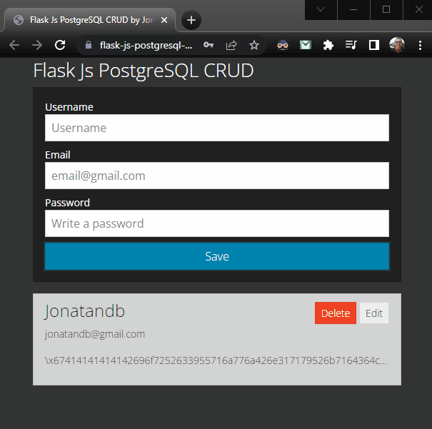

# Python, PostgreSQL & Javascript - Aplicación Web CRUD (Flask y Vanilla JS)

https://www.youtube.com/watch?v=Qqgry8mezC8

---

---

## Open project with VSCode

### Select Python interpreter from VSCode:

F1 -> Python: Select Interpreter -> Enter interpreter path -> Select: venv\Scripts\python.exe

### Open new integration terminal and run:

- python app.py

  - Visit: http://127.0.0.1:5000

  - (\* PostgreSQL must be installed and running)

---

### Push to Heroku

- git push heroku master
- Then visit: https://flask-js-postgresql-crud.herokuapp.com/

### Push to GitHub

- git push origin master

---
